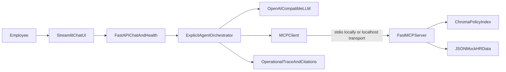

# HR Agentic RAG Project Plan

Build the project least-to-most: first establish a reproducible skeleton and one cited RAG path, then add MCP tools, multi-step workflows, evaluation, deployment, and the recorded demo. The target is the rubric’s score-5 criteria using a free-tier-compatible Python 3.12, Streamlit, FastAPI, MCP, Chroma, and provider-agnostic OpenAI-compatible model stack.

## Recommended architecture

Use an explicit, testable state-machine orchestrator instead of hidden chain-of-thought: classify intent, retrieve evidence, select MCP tools, validate results, request confirmation when needed, and synthesize the answer. Start with Groq or OpenRouter through an OpenAI-compatible client so the provider can be changed via environment variables.

## High-level activities, tools, and current availability

1. **Bootstrap and reproducibility**
   - Tools: Git (installed), Python 3.12 (installed), `venv` (included), pip (installed), Cursor (in use), GitHub CLI (installed but authentication is expired).
   - Needed: create the environment, dependency manifest, `.env.example`, secret-safe `.gitignore`, deterministic settings, README skeleton, and initial tests. Use Python 3.12 rather than the default 3.14 for broader package compatibility.

2. **Policy corpus and synthetic data**
   - Tools: Markdown/TXT authoring (available), PyPDF (not installed), BeautifulSoup (installed), JSON/CSV standard libraries (included).
   - Needed: author 8–12 coherent policies totaling 30–60 pages across at least Markdown and PDF/TXT, plus clearly synthetic employee, PTO, benefits, location, and ticket records. Track provenance and AI assistance.

3. **Ingestion, chunking, embeddings, and indexing**
   - Tools: Chroma, Sentence Transformers, and PyPDF (not installed).
   - Needed: heading-aware deterministic chunks with overlap, local `all-MiniLM-L6-v2` embeddings, persisted metadata (`document_id`, title, section, source, snippet), and a reproducible index command. Add retrieval tests before generation.

4. **Minimum cited RAG path**
   - Tools: OpenAI-compatible Python client and HTTPX (not installed); provider API key (not configured).
   - Needed: top-k retrieval, multi-document context assembly, inline citations/snippets, unsupported-question refusal, policy-versus-recommendation labeling, and one multi-policy test question.

5. **MCP server and real tool calls**
   - Tools: official Python MCP/FastMCP SDK (not installed).
   - Needed: MCP server with at least seven discoverable tools: `search_policy_documents`, `get_policy_section`, `lookup_employee_profile`, `check_pto_balance`, `lookup_benefits_status`, `check_policy_compliance`, and confirmation-gated `create_mock_hr_ticket` or `draft_hr_email`. The agent must invoke these through an MCP client, not direct function calls.

6. **Agentic workflows and safety**
   - Tools: manual Python state machine, Pydantic schemas, structured LLM output; no agent framework is required.
   - Needed: complete remote-work eligibility and PTO guidance workflows, including profile/data lookup, multi-policy retrieval, compliance checks, clarification/escalation, graceful tool failures, mock-only actions, explicit confirmation, and concise operational traces.

7. **Web experience and observability**
   - Tools: Streamlit and FastAPI/Uvicorn (not installed).
   - Needed: chat UI plus `/chat` and `/health`, citation cards, snippets, expandable tool-call trace (tool, safe arguments, result summary, sources, escalation), demo presets, and no hidden chain-of-thought.

8. **Automated tests and evaluation**
   - Tools: pytest (installed), custom evaluation scripts; optional plotting/report libraries (to decide later).
   - Needed: unit/integration/smoke tests, app-start test, MCP discovery/tool-call test, 20–30 gold tasks spanning all required categories, groundedness/citation/tool-selection/workflow/clarification/safety metrics, p50/p95 warm and cold latency, and one retrieval-k or chunk-size ablation.

9. **CI/CD and deployment**
   - Tools: GitHub Actions (repository configuration), GitHub CLI (needs reauthentication), Render or Railway web UI (CLI not installed), Docker (not installed and not required).
   - Needed: tests on push/PR; deploy only after tests pass; one free-tier service containing UI, API, agent, MCP process, local index, and mock data; environment-configured provider; health check and cold-start documentation.

10. **Documentation, rubric audit, and demo**
    - Tools: Markdown, Mermaid, screen recorder/presentation software (availability not yet checked).
    - Needed: `README.md`, `design-and-evaluation.md`, `ai-tooling.md`, `deployed.md`, architecture diagram, tool schemas, expected call sequences, rubric checklist, and a 7–10 minute two-workflow demo script.

## Intended repository shape

- `app/`: Streamlit UI, FastAPI routes, orchestration, provider adapter, schemas, and tracing.
- `mcp/`: MCP server and tool definitions.
- `rag/`: ingestion, chunking, indexing, retrieval, citations, and persisted index configuration.
- `policies/`: source corpus in at least two formats.
- `mock_data/`: synthetic records and mock actions.
- `evaluation/`: gold set, runner, metrics, ablation, and generated reports.
- `tests/`: unit, integration, MCP, API, safety, and smoke tests.
- `.github/workflows/ci.yml`: gated CI/deployment workflow.

## Least-to-most execution gates

1. **Foundation:** environment, skeleton, health check, and one passing test.
2. **Retrieve:** ingest a tiny corpus and prove deterministic retrieval with metadata.
3. **Answer:** produce one grounded answer with valid citations and refusal behavior.
4. **Tool:** discover and call one RAG MCP tool and one structured-data MCP tool.
5. **Workflow:** complete one multi-step task, then the second, with traces and safety checks.
6. **Productize:** finish UI/API, failure handling, full corpus, and all five-plus tools.
7. **Measure:** run the evaluation set, latency study, and ablation; fix weak results.
8. **Ship:** CI, free-tier deployment, documentation audit, rehearsal, and recorded demo.

At each gate, keep the scope small, run acceptance tests, compare against the rubric, and only then add the next layer. The first implementation session should stop after Gate 1 unless explicitly approved to continue.

## Implementation checklist

- [ ] Create the Python 3.12 project skeleton, reproducible environment, configuration, health check, and baseline test.
- [ ] Create synthetic policy/data assets and implement deterministic ingestion, indexing, retrieval, citations, and guardrails.
- [ ] Implement discoverable MCP tools and the explicit agent orchestrator with two safe multi-step workflows and operational traces.
- [ ] Build the Streamlit/API experience, comprehensive tests, 20–30 task evaluation, latency metrics, and ablation.
- [ ] Configure gated CI/deployment, complete required documentation, audit the rubric, and prepare the two-task demo.
