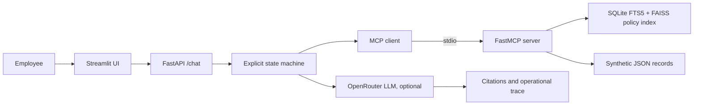

# RAGs to Riches

An MCP-backed HR policy assistant built entirely around fictional
policies and synthetic employee records. It demonstrates hybrid (keyword plus
local embedding) retrieval with citations, multi-step remote-work, PTO, and
benefits workflows, safe mock actions, operational traces, grounded OpenRouter
answer generation, evaluation with ablations, and a test-gated deployment.

This is a software demonstration—not legal, employment, medical, tax, or
benefits advice.

## Deployed application

- Application: <https://ragsto-riches.onrender.com>
- Health check: <https://ragsto-riches.onrender.com/_stcore/health>

The service runs on Render's free tier and sleeps after inactivity, so the
first request can take 30–60 seconds. See [deployed.md](deployed.md) for
deployment details and cold-start notes.

## Architecture



The orchestrator exposes states and tool activity, not hidden chain-of-thought.
FastAPI keeps one MCP session open; the agent discovers its tools on each turn
and escalates if a tool it needs is missing. A chat message is classified into
a policy question or a remote-work, PTO, or benefits request. Retrieval and
compliance decisions remain deterministic. Tool misses, such as an unknown
employee or location, come back as findings the assistant can explain. When
`OPENROUTER_API_KEY` is configured, an LLM interprets the message and writes
the cited answer from that evidence. Without a key, or when the model is
unavailable, answers use deterministic wording built from the same evidence.

## Run locally

Python 3.12 is required.

```bash
python3.12 -m venv .venv
source .venv/bin/activate
python -m pip install --upgrade pip
python -m pip install -r requirements.lock
python -m pip install --no-deps -e .
cp .env.example .env
python -m rag build
```

The first `python -m rag build` downloads the embedding model
(`BAAI/bge-small-en-v1.5`, about 66 MB) into `data/models/` and then runs
offline. It needs no API key. To skip embeddings and build a keyword-only
index, run `python -m rag build --no-embed`.

The copied `.env` leaves `OPENROUTER_API_KEY` blank. Open that file and put your key on the existing line:

```bash
OPENROUTER_API_KEY=your_key_here
```

That enables LLM-generated answers. You can optionally change `OPENROUTER_MODEL` from the default `dots-studio/dots-3-note-preview:free` model. Never commit the key.

OpenRouter's free models allow 50 requests per day per account unless the
account has purchased credits, which raises the limit to 1,000. A chat turn
uses at most two requests, and none when the reply is a clarification or a
refusal. A full graded evaluation uses about 30. When the limit is reached,
answers fall back to deterministic cited wording.

The install and `python -m rag build` only need to run once. Each new terminal starts without the virtual environment, so activate it from the project directory before starting a process. Otherwise `uvicorn` and `streamlit` are not on your PATH.

Start the API and UI in separate terminals:

```bash
source .venv/bin/activate
uvicorn app.main:app --reload
```

```bash
source .venv/bin/activate
streamlit run app/streamlit_app.py
```

Open <http://127.0.0.1:8501>. The API health endpoint is
<http://127.0.0.1:8000/health>. To exercise the same single-service supervisor
used in production, run `PORT=8501 python -m app.deploy`.

## Use the chatbot

Type a question in the chat box, or start from one of the sidebar examples:

- `I am SYN-1001. Can I work remotely from New York?` is eligible for review.
- `I am SYN-1003. Can I work remotely from Texas?` needs HR review.
- `I am SYN-1002. Can I take 8 hours of PTO?` is eligible for review.
- `I'm SYN-1002. Am I enrolled in benefits yet?` explains the closed
  enrollment window.
- Ask a policy question, such as `My laptop was stolen. Who do I tell?`
- To propose a mock ticket, add `Please create a mock HR ticket` to a request.
  The assistant asks you to confirm. Reply `Yes` and the ticket is written only
  after that confirmation.

`POST /chat` accepts `{"message": "...", "history": [...], "context": {...}}`
and returns the answer, citations, snippets, and tool trace. Each result
includes policy citation cards and an expandable trace of states, safe tool
arguments, summaries, and source names.

`GET /health` reports whether the MCP session is connected (with its tool
list), whether the index is loaded and in which retrieval mode, and whether an
LLM is configured.

## Retrieval and MCP

The twelve-policy Markdown/TXT corpus and all JSON records are explicitly
synthetic. `policies/manifest.json` records provenance and AI assistance.
Heading-aware chunks use fixed overlap, stable SHA-256 identifiers, and
deterministic ordering. Search fuses two rankings: SQLite FTS5 BM25 for exact
terms, and a FAISS index of local `bge-small` embeddings for meaning. Each
result includes the sentence closest to the question, which becomes the cited
snippet. A question is answered only when a chunk is close enough in meaning;
otherwise the assistant says the policies do not cover it.
`HR_RETRIEVAL_MODE=bm25` turns embeddings off to save about 230 MB of memory.

The commands below are optional examples for inspecting that index from a
terminal. Activate the virtual environment first. `search` and `answer` use the
index created by `python -m rag build`. The quoted text is a sample query you
can replace.

Search prints the top five matching policy chunks as JSON, including title,
section, source, snippet, score, similarity, and best-matching passage. Add
`--mode bm25` or `--mode vector` to compare a single ranker:

```bash
python -m rag search "Can I work from my parents' house in another state?"
```

Answer prints a short cited reply assembled from matching policy sentences. If
the index lacks enough support, the JSON label is `Escalation` and the text
tells the reader to contact HR:

```bash
python -m rag answer "Can I use PTO during parental leave?"
```

This last example starts the MCP tool server on standard input and output and
waits for a client. The chatbot already starts this server when you use the UI:

```bash
python -m hr_mcp.server
```

The eight MCP tools cover policy search/section retrieval, the location register, employee, PTO, and
benefits lookups, compliance checks, and confirmation-gated ticket creation.
The agent reaches all tool implementations through the MCP client boundary.

## Test the application

```bash
pytest
python -m evaluation.runner --mode offline --http local
```

The offline evaluation needs no API key. It runs the 30 gold tasks through the
real agent and MCP server, runs the ablation (BM25, vector, and hybrid
retrieval, chunk sizes, and removing individual tools), and times `/health`
and `/chat` over HTTP. Add `--skip-ablation` for a faster run.
`python -m evaluation.runner` without `--mode` runs the LLM-graded evaluation,
which requires `OPENROUTER_API_KEY`. If the daily limit stops it partway, it
saves the finished tasks; run it again with `--resume` after the limit resets.
Reports are written to
`evaluation/results/`; the committed results are summarized in
[design-and-evaluation.md](design-and-evaluation.md#evaluation-results).

## Deploy to Render

The included `render.yaml` runs the Streamlit UI, FastAPI API, MCP server,
policy index, and synthetic data in one Python web service.

1. Push the repository to GitHub.
2. In Render, create a new Blueprint and select the repository. Render detects
   `render.yaml`; apply the proposed `ragsto-riches` web service.
3. Wait for the build to install dependencies and create the policy index.
4. Open the service URL. Render checks `/_stcore/health` for readiness.

The service starts with `python -m app.deploy`. Streamlit listens on Render's
public `PORT`, while FastAPI listens on the private loopback port and is reached
by the UI through `HR_API_URL`.

Automatic Render deployments are disabled so releases can pass CI first. To
enable deployment from GitHub Actions:

1. Create a deploy hook in the Render service settings.
2. Add `RENDER_DEPLOY_HOOK_URL` as a GitHub repository or `production`
   environment secret.
3. Add `DEPLOYED_APP_URL` with the public Render service origin, such as
   `https://ragsto-riches.onrender.com`.
4. Push to `main`.

Pull requests and pushes to `main` run the tests, the offline evaluation
(which must pass at least 90% of tasks), and a start-up smoke test. The smoke
test launches `python -m app.deploy` and checks the UI health, API health (MCP
connected, index loaded), and one `/chat` answer. A push to `main` triggers
Render only after all of these pass, then polls the deployed health endpoint
for up to ten minutes. The LLM-graded evaluation runs separately, only on manual
dispatch, when `OPENROUTER_API_KEY` is set as a secret. It does not
gate deployment.

Free-tier instances may sleep, so the first request can take longer while the
service starts. Confirmed mock tickets use ephemeral local storage and may be
cleared by a restart or deployment.
