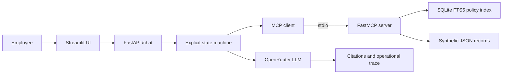

# RAGs to Riches

An MCP-backed HR policy assistant built entirely around fictional
policies and synthetic employee records. It demonstrates cited retrieval,
multi-step remote-work and PTO workflows, safe mock actions, operational traces,
grounded OpenRouter answer generation, evaluation, and a test-gated deployment.

This is a software demonstration—not legal, employment, medical, tax, or
benefits advice.

## Architecture



The orchestrator exposes states and tool activity, not hidden chain-of-thought.
Retrieval and compliance decisions remain deterministic. When
`OPENROUTER_API_KEY` is configured, an LLM turns the validated evidence into
the final cited answer. Invalid or unavailable model output falls back to safe
deterministic wording.

## Run locally

Python 3.12 is required.

```bash
python3.12 -m venv .venv
source .venv/bin/activate
python -m pip install --upgrade pip
python -m pip install -r requirements.lock
python -m pip install --no-deps -e .
cp .env.example .env
python -m rag build
```

Set `OPENROUTER_API_KEY` in `.env` to enable LLM-generated answers. You can
optionally change `OPENROUTER_MODEL` from the default
`inclusionai/ling-3.0-flash-vl:free` model. Never commit the key.

Start the API and UI in separate terminals:

```bash
uvicorn app.main:app --reload
```

```bash
streamlit run app/streamlit_app.py
```

Open <http://127.0.0.1:8501>. The API health endpoint is
<http://127.0.0.1:8000/health>. To exercise the same single-service supervisor
used in production, run `PORT=8501 python -m app.deploy`.

## Use the chatbot

- Remote work: use `SYN-1001` and `US-NY` for an eligible-for-review result, or
  `SYN-1003` and `US-TX` for an escalation.
- PTO: use `SYN-1002` and `8` hours for an eligible-for-review result.
- Mock action: select “Propose a mock HR ticket.” The first request asks for
  confirmation; a ticket is written only after explicit confirmation.

Each result includes policy citation cards and an expandable trace of states,
safe tool arguments, summaries, and source names.

## Retrieval and MCP

The eight-policy Markdown/TXT corpus and all JSON records are explicitly
synthetic. `policies/manifest.json` records provenance and AI assistance.
Heading-aware chunks use fixed overlap, stable SHA-256 identifiers, SQLite FTS5
BM25 ranking, and deterministic tie-breaking.

```bash
python -m rag search "fully remote tenure and location approval"
python -m rag answer "Can I use PTO during parental leave?"
python -m hr_mcp.server
```

The seven MCP tools cover policy search/section retrieval, employee, PTO, and
benefits lookups, compliance checks, and confirmation-gated ticket creation.
The agent reaches all tool implementations through the MCP client boundary.

## Test the application

```bash
pytest
python -m evaluation.runner
```

The evaluation command writes local reports under `evaluation/`. Generated
reports are ignored by Git.

## Deploy to Render

The included `render.yaml` runs the Streamlit UI, FastAPI API, MCP server,
policy index, and synthetic data in one Python web service.

1. Push the repository to GitHub.
2. In Render, create a new Blueprint and select the repository. Render detects
   `render.yaml`; apply the proposed `ragsto-riches` web service.
3. Wait for the build to install dependencies and create the policy index.
4. Open the service URL. Render checks `/_stcore/health` for readiness.

The service starts with `python -m app.deploy`. Streamlit listens on Render's
public `PORT`, while FastAPI listens on the private loopback port and is reached
by the UI through `HR_API_URL`.

Automatic Render deployments are disabled so releases can pass CI first. To
enable deployment from GitHub Actions:

1. Create a deploy hook in the Render service settings.
2. Add `RENDER_DEPLOY_HOOK_URL` as a GitHub repository or `production`
   environment secret.
3. Add `DEPLOYED_APP_URL` with the public Render service origin, such as
   `https://ragsto-riches.onrender.com`.
4. Push to `main`.

Pull requests and pushes to `main` run tests plus evaluation. A push to `main`
triggers Render only after those checks pass, then polls the deployed health
endpoint for up to ten minutes.

Free-tier instances may sleep, so the first request can take longer while the
service starts. Confirmed mock tickets use ephemeral local storage and may be
cleared by a restart or deployment.
