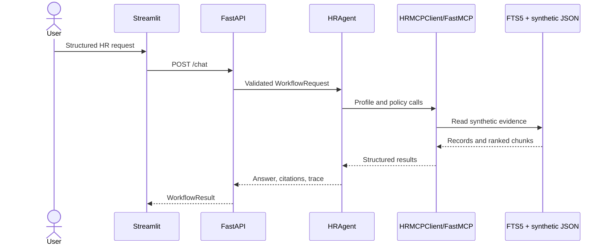

# Design and evaluation

## System design

RAGs to Riches separates user experience, orchestration, tool transport, and
data access. Streamlit submits a structured request to FastAPI. `HRAgent` runs
an explicit state machine and calls `HRMCPClient`; that client starts the
FastMCP server over stdio. Only MCP tools read the policy index or synthetic
records.



The system is deterministic and does not currently invoke an LLM. This makes
the workflows reproducible and avoids sending HR-shaped data to an external
provider. The trade-off is that free-form intent classification and natural
language generation are outside the current scope.

## Retrieval

Ingestion parses Markdown headings and plain-text sections, then creates
overlapping word chunks. Stable content-derived IDs and deterministic ordering
make rebuilds reproducible. SQLite FTS5 supplies BM25 lexical ranking. Every
result includes `document_id`, title, section, source, snippet, score, and chunk
identifier.

Answers are extractive, attach inline citation IDs, distinguish policy guidance
from escalation, refuse unsupported questions, and block common
instruction-override or secret-seeking prompts.

## API contracts

`POST /chat` accepts:

```json
{
  "workflow": "remote_work | pto",
  "employee_id": "SYN-1001",
  "requested_location_id": "US-NY | null",
  "requested_hours": 8.0,
  "create_ticket": false,
  "confirmed": false
}
```

The response contains `workflow`, `status`, `answer`, `citations`, `trace`, and
an optional `mock_action`. Status is one of `completed`,
`needs_clarification`, `confirmation_required`, or `escalated`. Trace entries
contain the state, tool name, safe arguments, status, result summary, and
sources. The `confirmed` value is deliberately excluded from trace arguments.

## MCP tool schemas

1. `search_policy_documents(query: str, top_k: int = 5)` returns ranked policy
   chunks and citation metadata.
2. `get_policy_section(source: str, section: str)` returns one exact section
   from an allow-listed policy file.
3. `lookup_employee_profile(employee_id: str)` returns a minimal synthetic
   profile with contact details removed.
4. `check_pto_balance(employee_id: str)` returns a synthetic PTO record.
5. `lookup_benefits_status(employee_id: str)` returns synthetic enrollment
   status.
6. `check_policy_compliance(workflow, employee_id,
   requested_location_id?, requested_hours?)` returns deterministic checks and
   `eligible_for_review`, `escalate`, or `needs_clarification`.
7. `create_mock_hr_ticket(employee_id, category, summary, confirmed=False)`
   returns a proposed action unless explicit confirmation is true; confirmed
   calls append only to the synthetic ticket store.

## Expected workflow call sequences

Remote work:

```text
classify
→ lookup_employee_profile
→ search_policy_documents
→ check_policy_compliance
→ [create_mock_hr_ticket when requested]
→ synthesize
```

PTO:

```text
classify
→ lookup_employee_profile
→ check_pto_balance
→ search_policy_documents
→ check_policy_compliance
→ [create_mock_hr_ticket when requested]
→ synthesize
```

Missing location or hours stops before tool use and requests clarification.
Failed checks escalate. A required tool failure returns a safe escalation and
takes no action.

## Safety and privacy

- IDs must match the reserved `SYN-####` pattern.
- The corpus and records contain no real personal data.
- Employee email is removed from tool responses.
- File retrieval is allow-listed to the policy directory.
- Mock ticket creation requires both an action request and confirmation.
- Outputs state that automated prerequisites are guidance, not approval.
- Operational traces expose tool activity, not private reasoning.

The ticket JSON file is mutable and local. A production HR system would require
authentication, authorization, encryption, audit retention, concurrency-safe
storage, and a real approval boundary; this demo must not be connected to one.

## Evaluation method and result

`evaluation/gold_tasks.json` has 25 tasks: full workflow outcomes, clarification
cases, policy retrieval, unsupported requests, and unsafe prompts. The runner
executes the real MCP boundary and computes:

- groundedness and expected-source overlap;
- inline citation validity;
- exact tool selection/order;
- expected workflow status and clarification behavior;
- mock-action safety;
- cold index/MCP startup and warm task p50/p95 latency.

The latest checked local run passed 25/25 tasks with `1.0` for all six metrics.
Timing is machine-dependent and should be read from the CI artifact for a
comparable run; the runner records warm p50/p95 plus index-build and MCP-startup
cold samples.

The ablation evaluates chunk sizes `100`, `180`, and `260` against `top_k`
values `3`, `5`, and `8`. All nine configurations reached `1.0` source-hit and
grounded rates on the seven positive retrieval tasks. The measured winner can
change between runs because all mean latencies are sub-millisecond; the latest
run selected chunk size `260`, overlap `40`, and `top_k=5`. The runtime retains
the conservative `180/30` and workflow `top_k=8` settings because the gold set
is small; changing them based only on timing noise would overfit this benchmark.

## Limitations

The corpus has eight compact policies rather than a production-sized policy
library. Lexical FTS5 retrieval replaces the originally considered embedding
stack, and free-form LLM interpretation is absent. Evaluation is deterministic,
small, and synthetic; perfect scores do not establish real-world quality.
Render free instances can cold-start, and the JSON ticket store is ephemeral
and unsuitable for concurrent production writes.
