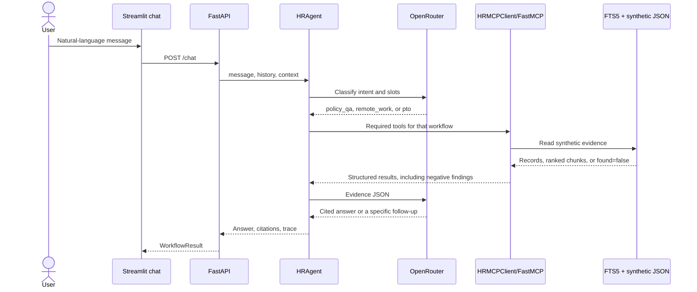

# Design and evaluation

## System design

RAGs to Riches separates user experience, orchestration, tool transport, and
data access. Streamlit submits a natural-language message to FastAPI.
`HRAgent` classifies that message, runs an explicit state machine, and calls
`HRMCPClient`; that client starts the FastMCP server over stdio. Only MCP
tools read the policy index or synthetic records.



Intent classification uses the configured LLM when `OPENROUTER_API_KEY` is set.
Explicit employee IDs, catalog locations, and hour amounts in the message are
kept even if the model omits them. Retrieval, compliance checks, and action
gating stay deterministic, so the model cannot change an eligibility decision.
Missing records and failed checks are returned as findings. The answer LLM
explains those findings to the user. Provider failures fall back to
deterministic wording that includes the same findings.

## Retrieval

Ingestion parses Markdown headings and plain-text sections, then creates
overlapping word chunks. Stable content-derived IDs and deterministic ordering
make rebuilds reproducible. SQLite FTS5 supplies BM25 lexical ranking. Every
result includes `document_id`, title, section, source, snippet, score, and chunk
identifier.

Answers attach inline citation IDs, distinguish policy guidance from
escalation, and constrain the model to validated evidence. Retrieved text is
explicitly treated as untrusted data to reduce prompt-injection risk.

## API contracts

`POST /chat` accepts:

```json
{
  "message": "I am SYN-1001. Can I work remotely from New York?",
  "history": [{"role": "user", "content": "..."}, {"role": "assistant", "content": "..."}],
  "context": null
}
```

`history` carries the recent conversation. `context` is the slot state returned
by the previous turn, including a pending mock-ticket confirmation. The
response contains `workflow`, `status`, `answer`, `citations`, `trace`,
`context`, and an optional `mock_action`. Workflow is `remote_work`, `pto`,
`policy_qa`, or `unsupported`. Status is one of `completed`,
`needs_clarification`, `confirmation_required`, or `escalated`. Trace entries
contain the state, tool name, safe arguments, status, result summary, and
sources. The `confirmed` value is deliberately excluded from trace arguments.

## MCP tool schemas

1. `list_work_locations()` returns the synthetic location register and which
   entries support regular remote employment.
2. `search_policy_documents(query: str, top_k: int = 5)` returns ranked policy
   chunks and citation metadata.
3. `get_policy_section(source: str, section: str)` returns one exact section
   from an allow-listed policy file.
4. `lookup_employee_profile(employee_id: str)` returns a minimal synthetic
   profile with contact details removed.
5. `check_pto_balance(employee_id: str)` returns a synthetic PTO record.
6. `lookup_benefits_status(employee_id: str)` returns synthetic enrollment
   status.
7. `check_policy_compliance(workflow, employee_id,
   requested_location_id?, requested_hours?)` returns deterministic checks and
   `eligible_for_review`, `escalate`, or `needs_clarification`.
8. `create_mock_hr_ticket(employee_id, category, summary, confirmed=False)`
   returns a proposed action unless explicit confirmation is true; confirmed
   calls append only to the synthetic ticket store.

Unknown employees, locations, policy sections, and rejected ticket summaries
return `found: false` or `rejected: true` with a `reason`. Those payloads are
evidence for the answer, not MCP errors. MCP `isError` remains reserved for a
broken index, unreadable data file, or dead server.

## Expected workflow call sequences

Remote work, after the message names an employee and a location:

```text
classify
→ lookup_employee_profile
→ search_policy_documents
→ check_policy_compliance
→ [create_mock_hr_ticket when requested]
→ synthesize
```

PTO, after the message names an employee and a number of hours:

```text
classify
→ lookup_employee_profile
→ check_pto_balance
→ search_policy_documents
→ check_policy_compliance
→ [create_mock_hr_ticket when requested]
→ synthesize
```

Policy questions:

```text
classify
→ search_policy_documents
→ synthesize
```

Demo utterances:

- `I am SYN-1001. Can I work remotely from New York?`
- `I am SYN-1002. Can I take 8 hours of PTO?`

A missing location, hour amount, or employee ID stops before eligibility tools
and asks for that detail. A named place that is not in the location register
is reported as unsupported, along with the locations that do support regular
remote work. An unknown ID still calls the lookup so the finding
can be explained. Failed checks escalate. A required infrastructure failure
returns a safe escalation and takes no action. Prompt-injection attempts are
blocked before any tool call.

## Safety and privacy

- IDs must match the reserved `SYN-####` pattern.
- The corpus and records contain no real personal data.
- Employee email is removed from tool responses.
- File retrieval is allow-listed to the policy directory.
- Mock ticket creation requires both an action request and confirmation.
- Outputs state that automated prerequisites are guidance, not approval.
- Operational traces expose tool activity, not private reasoning.

The ticket JSON file is mutable and local. A production HR system would require
authentication, authorization, encryption, audit retention, concurrency-safe
storage, and a real approval boundary; this demo must not be connected to one.

## Evaluation method and result

`evaluation/gold_tasks.json` has 25 natural-language tasks: full workflow
outcomes, clarification cases, policy retrieval, unsupported requests, and
unsafe prompts. `python -m evaluation.runner` requires `OPENROUTER_API_KEY`.
It sends each message through the chat agent, using the same intent extractor
and answer synthesizer as `/chat`, then asks an LLM judge to score the model
answer against the tool evidence and citation snippets. Structural checks still
cover:

- expected-source overlap and inline citation validity;
- exact tool selection/order;
- expected workflow status and clarification behavior;
- mock-action safety;
- cold index/MCP startup and warm task p50/p95 latency, including model time.

A task whose answer fell back to deterministic wording fails groundedness and
citation accuracy, so the report does not treat fallback text as model quality.
Pytest runs the same tasks in `offline` mode, without a provider call, to lock
tool behavior. Timing is machine-dependent and should be read from the CI
artifact for a comparable run; the runner records warm p50/p95 plus index-build
and MCP-startup cold samples.

The ablation evaluates chunk sizes `100`, `180`, and `260` against `top_k`
values `3`, `5`, and `8`. All nine configurations reached `1.0` source-hit and
grounded rates on the seven positive retrieval tasks. The measured winner can
change between runs because all mean latencies are sub-millisecond; the latest
run selected chunk size `260`, overlap `40`, and `top_k=5`. The runtime retains
the conservative `180/30` and workflow `top_k=8` settings because the gold set
is small; changing them based only on timing noise would overfit this benchmark.

## Limitations

The corpus has twelve synthetic policies, sized to the rubric's 30–60 page
range, rather than a production HR library. Lexical FTS5 retrieval replaces the originally considered embedding
stack. Graded answer quality depends on the configured OpenRouter model and
can vary between runs. The gold set is small and synthetic; strong scores do
not establish real-world quality.
Render free instances can cold-start, and the JSON ticket store is ephemeral
and unsuitable for concurrent production writes.
